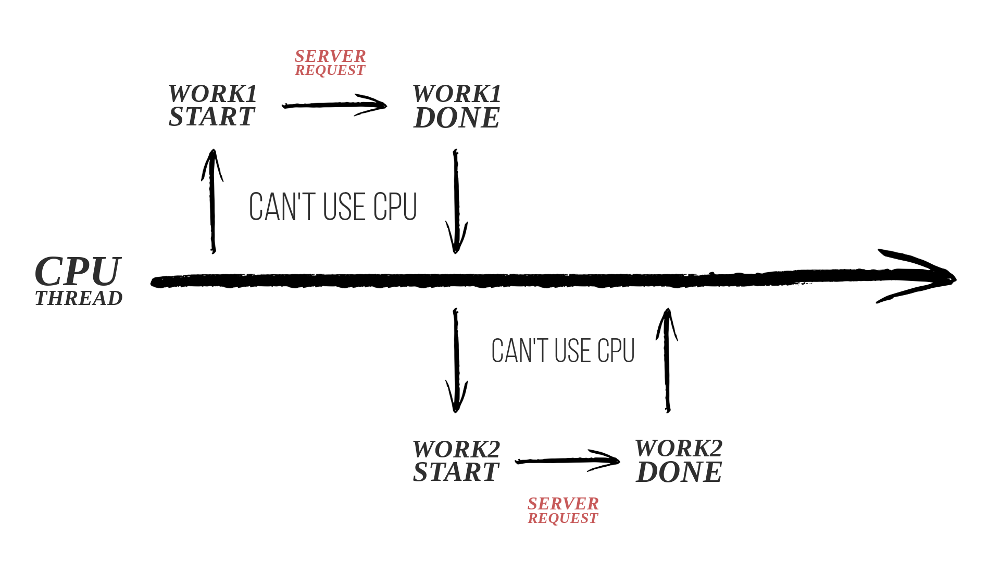
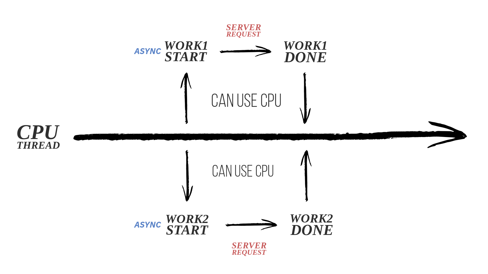

# 비동기 프로그래밍이란?
비동기 프로그래밍은 프로그램이 특정 작업을 시작하고, 그 작업이 완료될 때까지 기다리지 않고 다른 작업을 계속할 수 있게 하는 프로그래밍 기법이다. 이 방식은 주로 시간이 오래 걸릴 수 있는 작업들(예: 데이터베이스 쿼리, 파일 입출력, 네트워크 요청 등)을 처리할 때 사용되며, 사용자 인터페이스가 멈추지 않고 반응적으로 유지될 수 있으며, 애플리케이션의 전반적인 성능과 반응성을 개선할 수 있다.

네트워크 요청은 CPU를 사용하지 않는 작업이다. 하지만, 네트워크 요청을 하면, 서버에서 작업 처리가 완료 될 동안 기다려야 하기 때문에, 가용한 CPU를 막아 버리며 리소스를 낭비하게 된다. 따라서 다음과 같이 비동기처리를 함으로써, 리소스를 낭비하지 않고 효율적인 작업이 가능하다.

