이번 포스트에선 진행 중이던 소셜 앱 작업에서 회원가입 기능을 구현하는 로직을 정리해 보려한다.

우선, MVVM 아키텍쳐 기반 코드이고, 다음은 '로그인' 및 '회원가입'을 위한 비즈니스 로직을 설계한 각각의 ViewModel이다.

### LoginViewModel
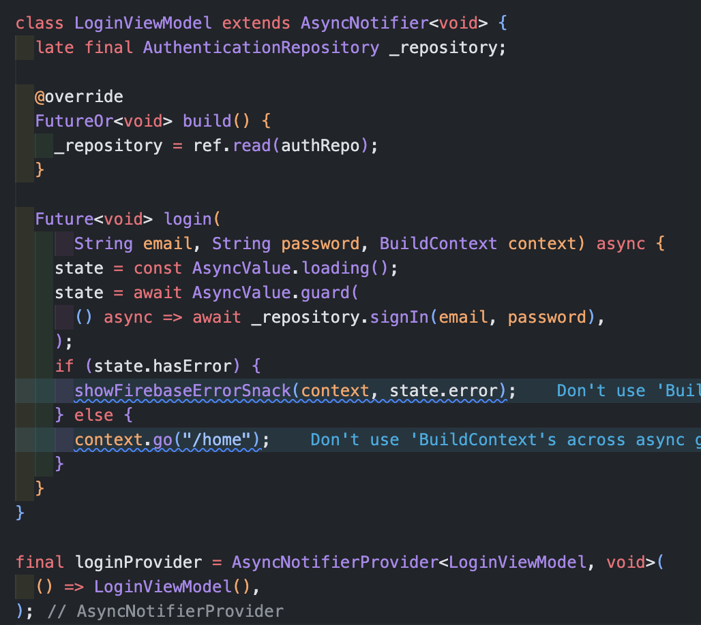

<br>


### SignUpViewModel
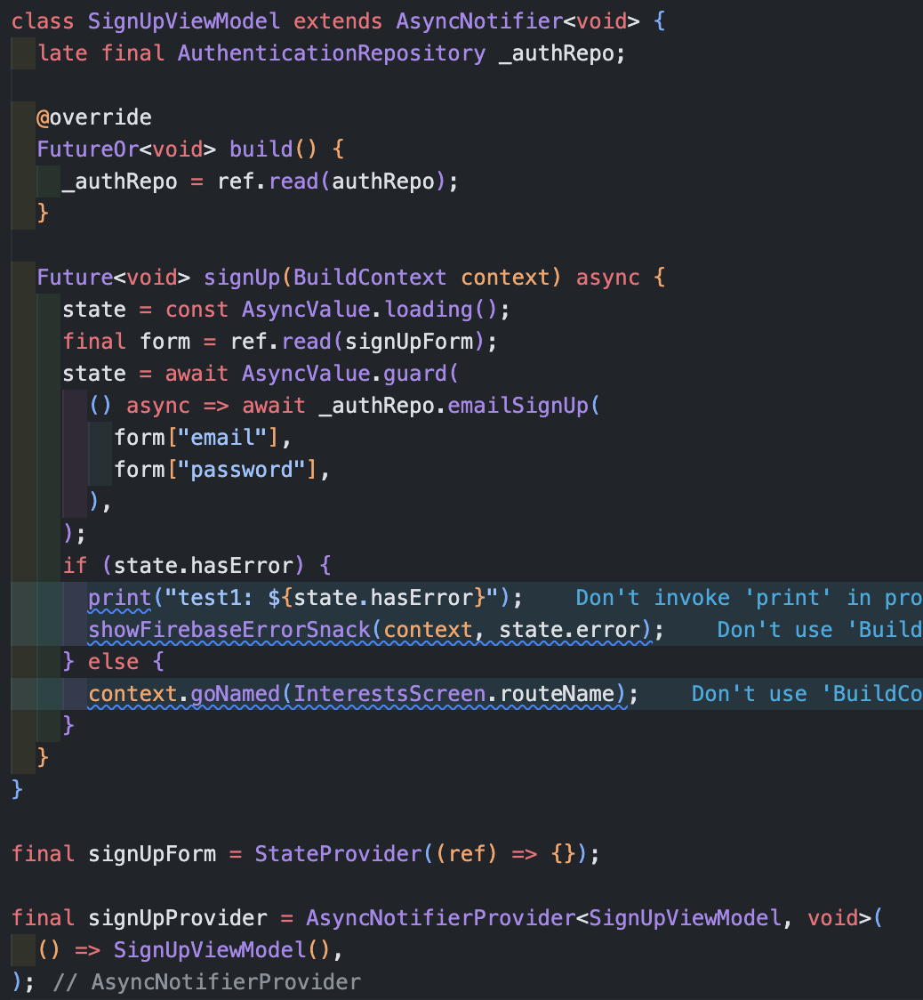

<br>
<br>

회원가입 과정에서 유저가 `textfield`에 입력하는 자신의 이메일(계정)을 담기 위한 `String`타입의 `_email`이라는 변수를 다음과 같이 선언하고, 그 값을 담기 위한 로직을 `InitState`에 정의했다.

### EmailScreen InitState
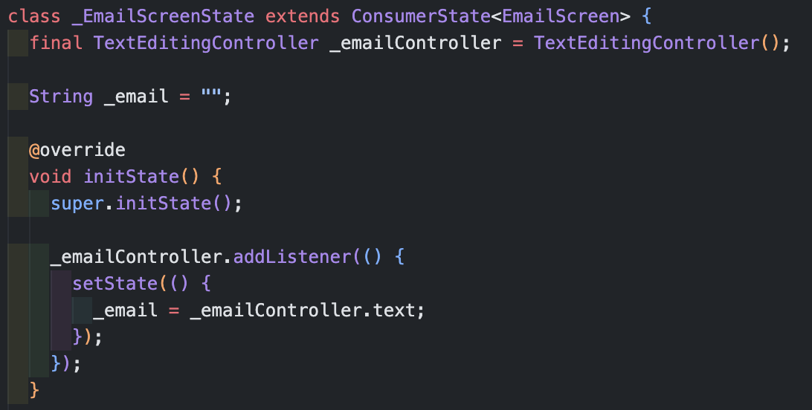

<br>

`TextEditingController`인 `_emailController`에 `addListener`를 추가함으로써, `TextField` 위젯에서 변경(유저의 입력)이 있을 때마다, 지속적인 감지 및 상태 변경를 통해 `_email`의 값을 최신 상태로 갱신하는 동시에 재빌드한다.

<br>

### EmailScreen Next버튼 콜백함수 '_onSubmit()'
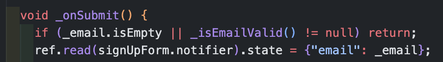

유저가 작성을 마치고 'Next' 버튼을 누르면, `onTap`콜백을 통해 `_onSubmit`함수가 실행되고, `ref.read(signUpForm.notifier).state`으로`SignUpViewModel`아래 정의한 `StateProvider`(상태 저장 및 관리 가능)인 `signUpForm`에 `Map`형식으로 위와 같이 저장된다.

<br>

### PasswordScreen Next버튼 콜백함수 '_onSubmit()'
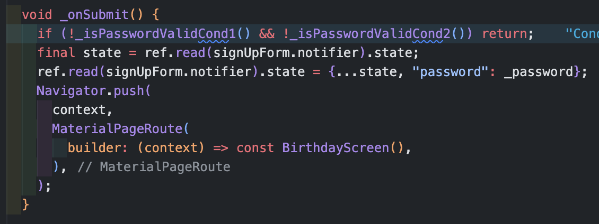

password도 같은 로직이다. 하지만 여기서 주의해야 할 것이있다. 상태를 갱신하기 위해 `ref.read(signUpForm.notifier).state = {"password": _password};`으로 작성하면, 기존의 `email`키와 그 값이 완전히 대체된다. 

따라서 `ref.read(signUpForm.notifier).state = {...state, "password": _password};`처럼, 먼저 기존 상태`ref.read(signUpForm.notifier).state;`를 `state`라는 변수명에 할당하고, 이것을 Dart의 Spread 연산자 `...`를 이용하여 펼쳐, 새로운 컬렉션에 추가하는 방식으로 구현해야한다.

<br>

### BirthdayScreen의 콜백함수_onNextTap()
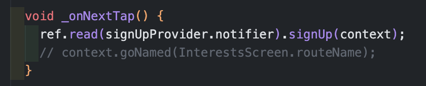

이 역시, 'Next' 버튼의 콜백함수인 `_onSubmit`으로 `email`,`password`키와 각각의 값을 담은 `signUpForm`이 완성된다.

<br>

그 다음인 '생년월일 설정' 화면에서 'Next'버튼을 누르면 `ref.read(signUpProvider.notifier).signUp(context);`코드가 실행된다. 이를 통해 `SignUpViewModel`의 인스턴스인 `signUpProvider`의 `signUp`메서드가 호출된다.

### SignUpViewModel.signUp()
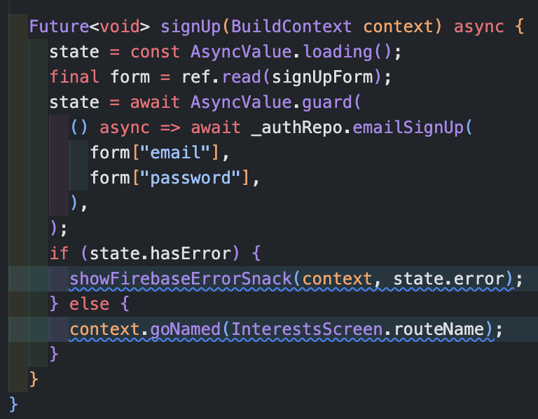

여기서, `state`는 `AsyncNotifier`의 내부 속성으로, 비동기 작업 상태를 관리(저장/변경)하며, `AsyncNotifier`의 메서드인 `AsyncValue`를 통해 상태를 관리한다. 

여기서 사용된, `AsyncValue.guard`는 `try`와 `catch`를 한번에 수행하는 메서드이고, 위 코드에서 처럼 `form`이라는 변수에 `Provider`로 `signUpForm`을 참조하는 `ref.read(signUpForm);`을 설정하고, 기존에 정의해둔 아래 `AuthenticationRepository`의 인스턴스 `_autoRepo`의 `emailSignUp`메서드를 통해, Firebase인증 시스템으로 이메일과 비밀번호를 사용하여 회원가입을 처리한다.


### AuthenticationRepository
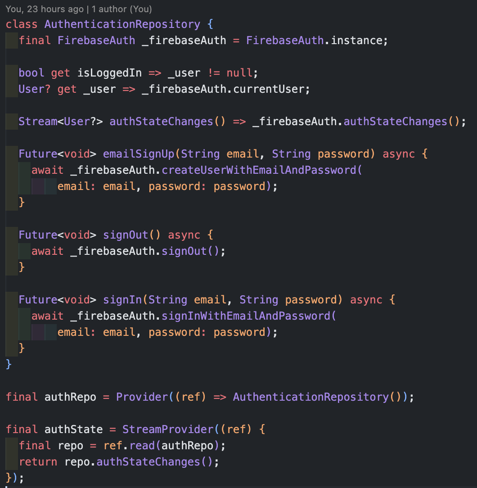

<br>
그러면 다음과 같이 Firebase Console에 계정이 등록된 것을 확인 할 수 있다.
<br>

### Firebase Console
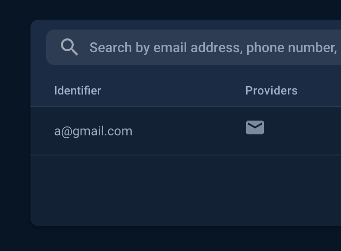


<br>
<br>
<br>


## Social Auth 등록 방법 (ex: Github)

### *다음은 소셜 계정을 이용한 회원가입 기능 구현이다.*

<br>

### Firebase Console/Authentication
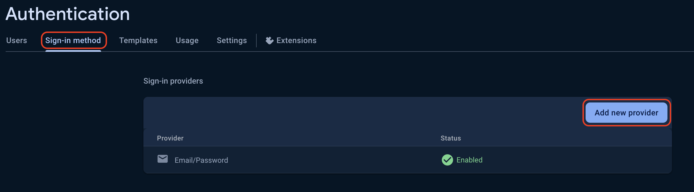

### *소셜인증 플랫폼 선택을 위해 'Authentication'탭의 'Sign-in method'에서 'Add new provider'를 누른다.*

<br>

### Firebase Console/Authentication
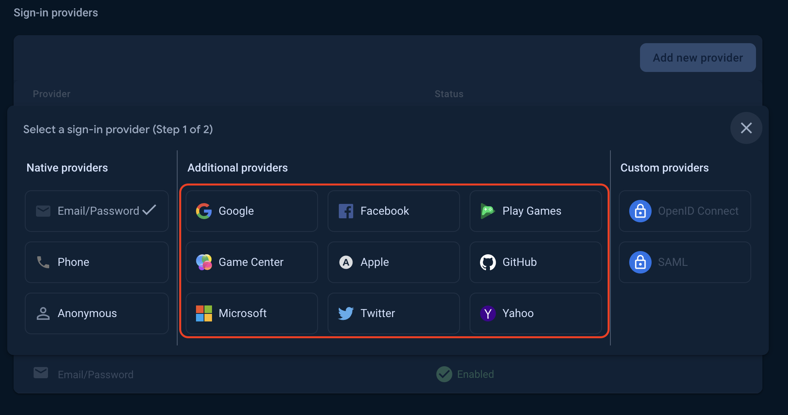

### *현재 시점에선 위처럼 Native를 제외한 9개의 소셜 provider를 기본으로 제공하고있다.*

<br>

### Firebase Console/Authentication
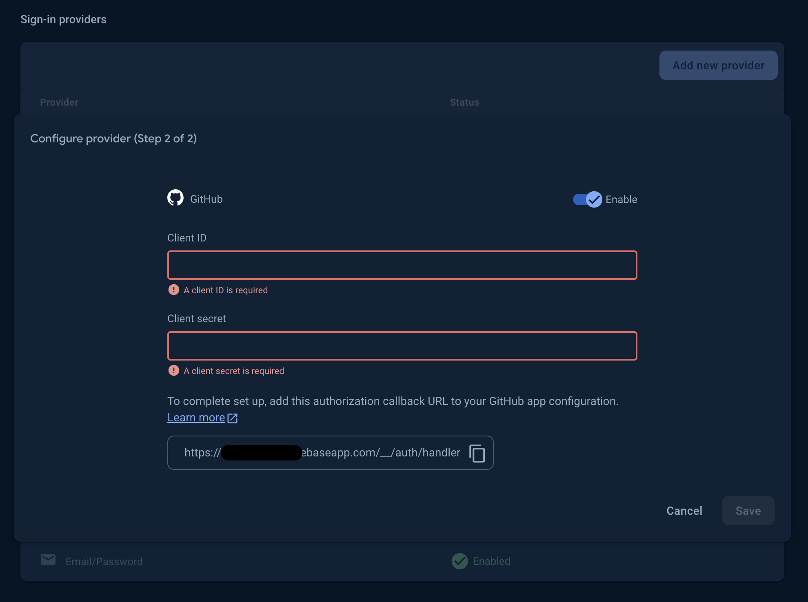

### *우측 상단에 'Enable'를 누르고, 'authorization call back URL'을 복사한다.*

<br>

### Github
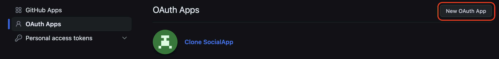

### *Github 'Setting' > Developer Setting탭 선택 > OAuth Apps탭 선택 > 'New OAuth App'클릭*

<br>

### Github
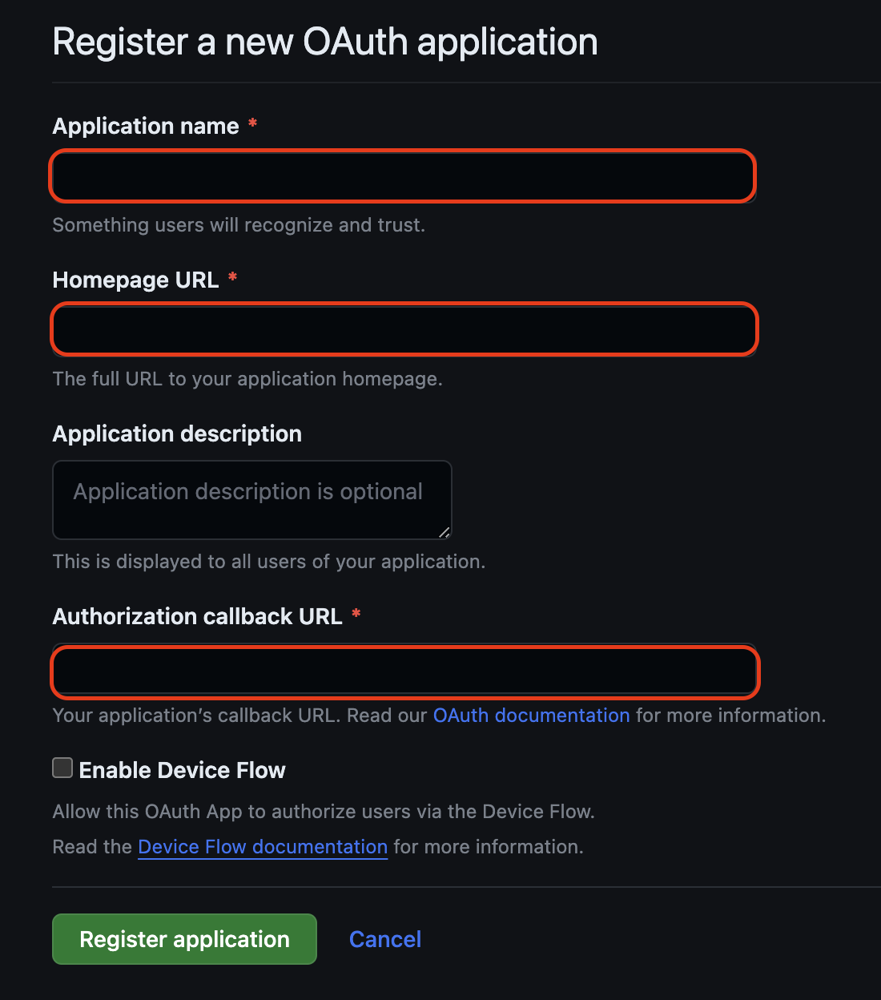

### *앱 이름과 주소를 설정하고, 'Authorization callback URL'에 복사한 URL을 붙혀넣기한 후, 'Register application'을 누른다.*

<br>

### Github
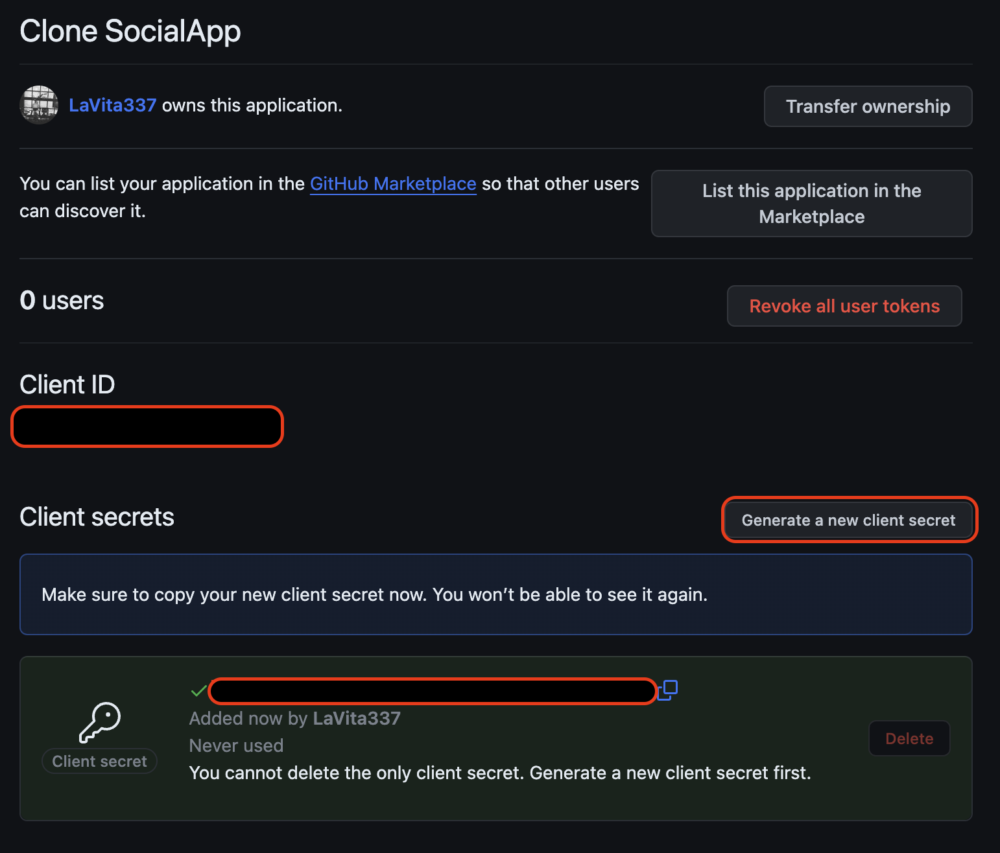

### *'Client ID'가 표시되고, 'Generate new client secret'를 누르면 'Client secret'이 생성된다.*

<br>

### Firebase Console/Authentication
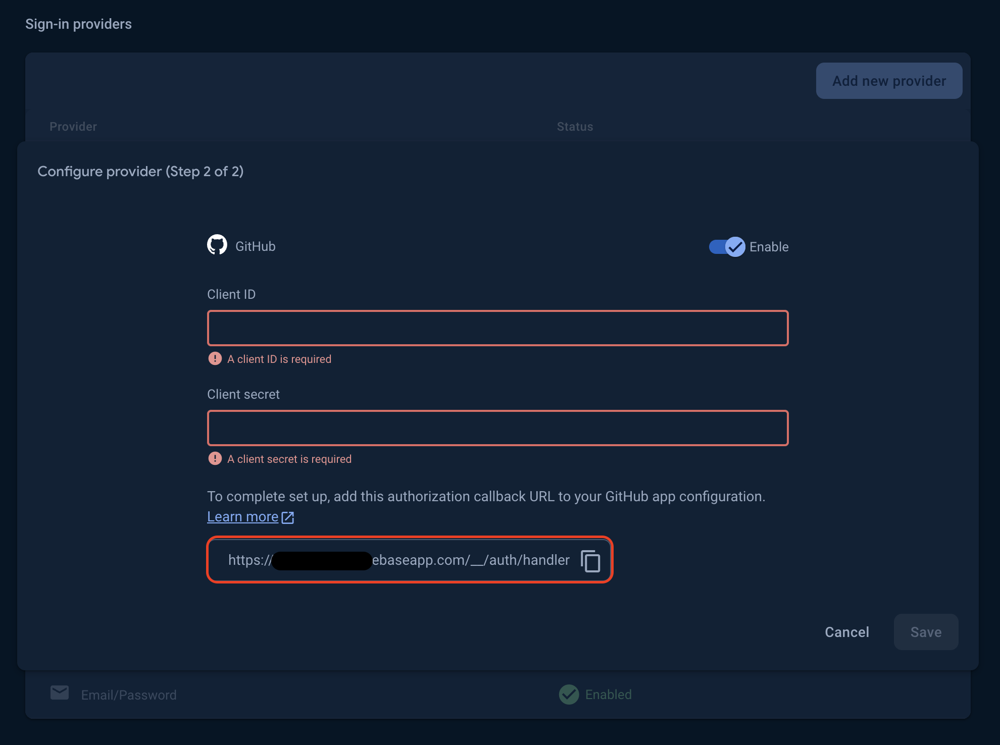

### *생성된 'Client ID'와 'Client secret'을 Firebase Console로 돌아와 붙혀넣는다.*

<br>

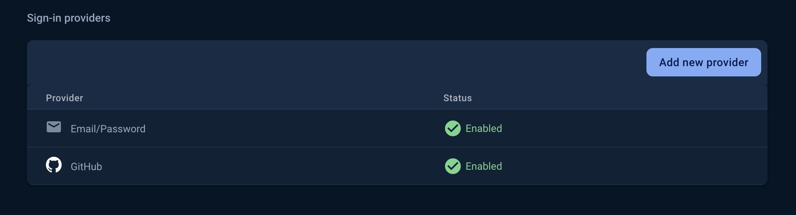

### *위 과정을 거치면, 'GitHub provider'가 생성된 것을 볼 수 있다.*

### *여기까지가 준비단계이고, Android와 iOS 모두 위 단계를 따른다. 하지만 여기서 소셜인증을 구현하기위해 약간의 각각 다른 추가적인 작업이 필요하고, 이는 다음의 Firebase문서를 참조가 필요하다.*

> #### firebase 공식문서(Android) 링크: https://firebase.google.com/docs/auth/android/github-auth
> #### firebase 공식문서(iOS) 링크: https://firebase.google.com/docs/auth/ios/github-auth


<br>

## Android
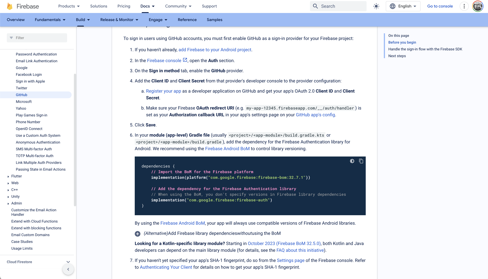

<br>

### *정리해보자면, 먼저 안드로이드 프로젝트에는 두개의 'build.gradle'이 있다. 하나는, '프로젝트 레벨 build.gradle', 다른 하나는 'App 모듈 레벨 build.gradle'이다. 여기서 'App 모듈 레벨 build.gradle'(app/build.gradle)에 다음과 같은 방식으로 종속성을 추가한다.*

```gradle
// 앱 모듈 레벨 build.gradle 파일

dependencies {
    // 기존 종속성들...

    // Firebase 관련 종속성 추가
    implementation(platform("com.google.firebase:firebase-bom:32.7.1"))
    implementation("com.google.firebase:firebase-auth")

    // 다른 필요한 종속성들...
}
```

<br>

### Firebase Console/Authentication

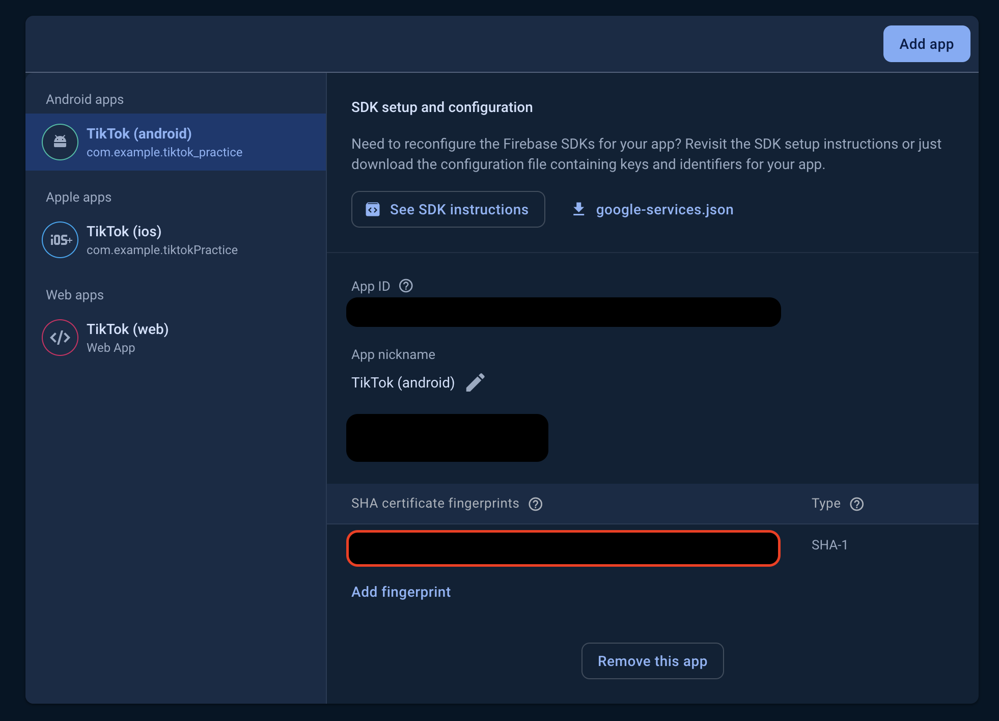

### *마지막으로, SHA-1 키 등록을 진행한다. (debug, release 버전이 있기 때문에, 앱 배포 시, release 버전의 SHA-1 key가 등록이 되지 않으면 소셜인증을 사용할 수 없음)*

<br>


## iOS
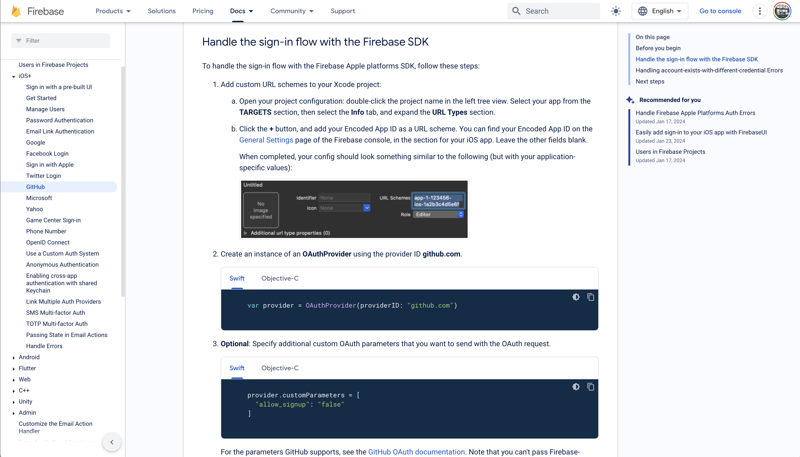

### *iOS는 xCode에서 'Target'섹션 > 'Info' 탭 > 'URL Type'을 확장한 후, + 버튼으로 Firebase에서 가져온 'App ID'를 붙혀넣기만 해주면 된다.*

<br>

### Firebase Console/Authentication

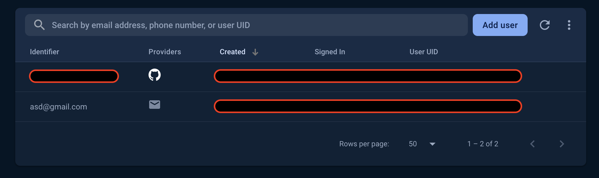

### *앱 내에서 회원가입을 진행하고, Firebase Console/Authentication/Users를 확인해보면 다음과 같이 깃허브계정으로 회원가입이 정상적으로 된 것을 확인 할 수 있다.*
<br>