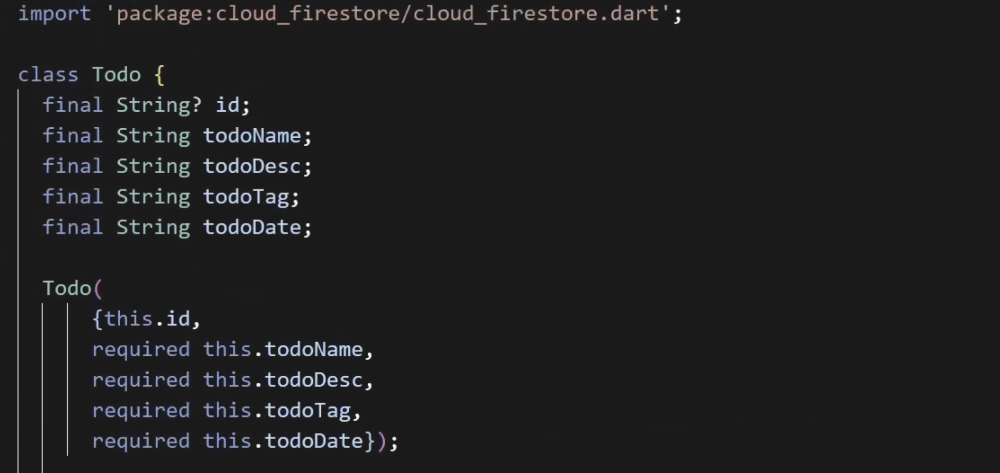
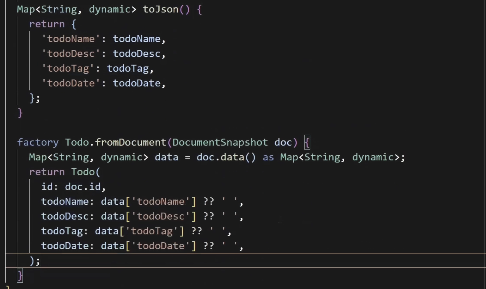

# **기본 생성자 vs factory 생성자**

### 기본 생성자

> 클래스 이름(Todo)과 동일한 이름을 가진 생성자로, 클래스의 인스턴스를 생성할 때 호출되고, 기본 생성자는 클래스의 필드를 초기화하는 데 사용된다. 이 경우에는 `id`, `todoName`, `todoDesc`, `todoTag`, `todoDate` 등의 필드를 초기화한다.

### factory 생성자

> `factory` 키워드를 사용하는 팩토리 생성자는 일반적인 생성자와 달리 객체를 직접 생성하는 대신 다른 방법으로 객체를 반환할 수 있다. 예를 들어, `Todo.fromDocument` 팩토리 생성자는 `Firestore`의 `DocumentSnapshot` 객체를 입력으로 받는데, 이 `DocumentSnapshot` 객체는 `Firestore` 데이터베이스에서 읽어온 단일 문서의 데이터를 포함하고 있으며, 이 데이터를 기반으로 `Todo` 클래스의 새 인스턴스를 생성한다. 주로 `Firestore` 데이터베이스에서 문서를 읽어올 때 사용되는 이 팩토리 생성자는 `DocumentSnapshot`에서 추출된 데이터를 활용하여 `Todo` 객체의 인스턴스를 만든다.

*`fromDocument` `factory` 생성자는 다음과 같은 경우에 사용할 수 있다:

- **Firestore 문서 읽기**: Firestore에서 데이터를 읽어올 때, 각 문서의 데이터는 `DocumentSnapshot` 객체로 반환한다. 이 객체를 fromDocument 팩토리 생성자에 전달하여 앱에서 사용할 `Todo` 객체로 변환할 수 있다.

- **데이터 변환**: `DocumentSnapshot`에서 `data()` 메서드를 호출하여 얻은 원시 데이터를 Dart 객체로 변환할 때 사용된다. 이 변환 과정은 데이터의 형태를 앱 내에서 사용하기 쉬운 형태로 매핑하는 것이다.

- **타입 안정성과 코드 재사용**: fromDocument를 사용함으로써, Firestore 문서로부터 Todo 객체를 생성하는 과정을 일관되고 안정적으로 만들 수 있으며, 이 로직을 앱의 여러 부분에서 재사용할 수 있다.

