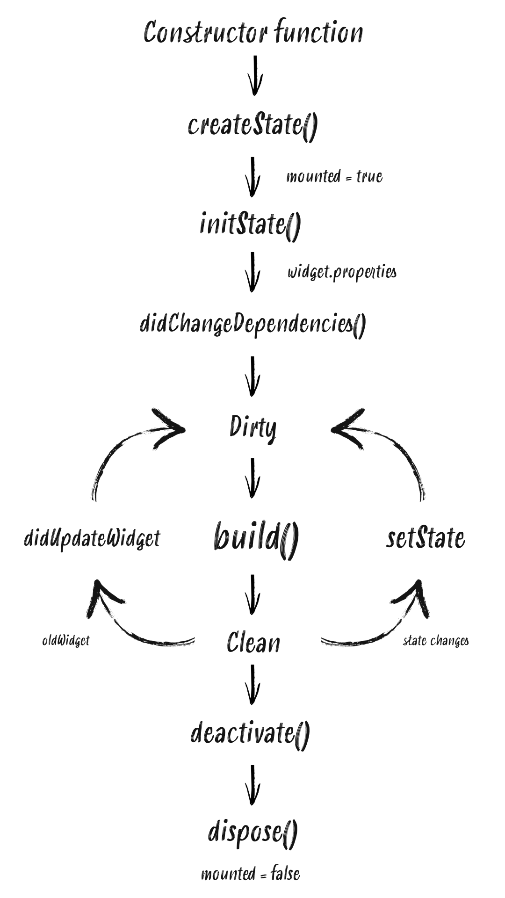

# Widget Lifecycle 개념정리

Flutter로 프로그래밍을 하면서, 코드의 복잡성 증가와 데이터를 관리에 있어서 웨젯 라이프사이클 이해의 중요성을 깊이 느꼈다. 이번 포스트에서 먼저 주요 개념들을 정리해보려고 한다.


### *WHY?*

1. **성능 최적화**: 위젯 라이프사이클을 이해하면 앱의 성능을 향상시킬 수 있고, 앱의 각 단계에서 필요한 리소스를 관리하고 불필요한 리소스를 해제함으로써, 앱의 메모리 사용과 CPU 사용을 최적화할 수 있다.

2. **올바른 데이터 관리**: 위젯이 생성되고 소멸되는 시점을 알면, 데이터를 올바르게 관리할 수 있다. 예를 들어, 위젯이 화면에 나타날 때 데이터를 로드하고, 위젯이 사라질 때 데이터를 저장하거나 정리하는 것이 필요할 수 있다.

3. **버그 방지**: 라이프사이클 이벤트를 이해하고 적절히 사용하면, 예기치 않은 버그를 방지할 수 있다. 예를 들어, 위젯이 화면에서 사라진 후에도 데이터를 업데이트하려고 하면 오류가 발생할 수 있다.

4. **상태 관리**: Flutter는 상태 관리에 크게 의존한다. 위젯의 라이프사이클을 이해하면, 언제 상태를 업데이트해야 하는지, 어떻게 데이터를 효율적으로 유지할 수 있는지를 알 수 있다.

5. **사용자 경험 개선**: 위젯의 로딩, 업데이트, 소멸 과정을 잘 관리하면 사용자 경험을 개선할 수 있다. 예를 들어, 사용자가 기다리는 시간을 줄이거나, 원활한 애니메이션과 전환을 제공할 수 있다.

<br>
<br>

Flutter에서는 `StatefulWidget`과 `StatelessWidget`의 라이프사이클에 주목하여, 각 위젯이 어떻게 생성되고, 업데이트되며, 소멸하는지를 파악하는 것이 중요하기때문에, 위젯 라이프사이클을 이해하고 적절히 활용하면, 효율적이고 사용자 친화적인 앱을 개발할 수 있다.




<br>

위젯과 상태는 Flutter 앱을 구성하는 핵심적인 개념이다. 상태는 위젯의 특성을 정의하며, 텍스트 내용, 스타일링 속성 등 위젯의 모든 가변적 특성을 포함한다. 위젯이 어떻게 행동하고 사용자의 입력에 반응하는지는 상태를 통해 결정된다. 이러한 상태들은 Flutter의 위젯 트리를 통해 체계적으로 관리된다.

<br>


### Stateless Widgets
`StatelessWidget`은 변경 불가능한 상태를 가진다. 이러한 위젯은 초기에 생성된 후 상태의 변화에 반응하지 않으므로, 상태를 갖지 않는 것처럼 보일 수 있다. 하지만, `build()` 메서드를 통해 UI를 구성하므로, 이 메서드는 위젯이 화면에 그려질 때마다 호출된다. 따라서 `StatelessWidget`은 변화가 없을 때 사용하기 적합하며, 라이프사이클이 매우 단순하다.


### Stateful Widgets
`StatefulWidget`은 상태 변화에 반응한다. 이 위젯은 상태를 가지며, 상태 변경 시 `build()` 메서드를 통해 UI를 갱신한다. `StatefulWidget`은 `State` 객체와 결합되어 있으며, 이 객체는 위젯의 모든 동적 상태를 추적한다. `setState()` 메서드를 사용하면 `State` 객체 내의 상태를 언제든지 갱신할 수 있다. 이러한 특성으로 인해 `StatefulWidget`은 동적인 사용자 경험을 제공하지만 관리가 복잡하고 성능에 영향을 줄 수 있다.


Flutter에서 `StatefulWidget`을 구축할 때, 먼저 위젯의 생성자 함수를 실행하고 이어서 `createState()` 메서드를 호출한다. 이는 `State` 객체의 라이프사이클이 시작되는 지점이다.

<br>


### createState() Method
`createState()`는 `State` 객체를 생성하고 위젯의 변경 가능한 모든 상태를 유지한다. 이 메서드는 `StatefulWidget`에 필수적이며, `State` 객체를 빌드 컨텍스트에 연결하여 위젯 트리에 존재하는지 여부를 나타내는 `mounted` 속성을 설정한다.

<br>


>### initState() Method
>`State` 객체가 트리에 삽입되면, `initState()`가 호출된다. 이 메서드는 객체가 생성될 때 단 한 번만 실행되며, 여기서 데이터 피드를 설정하거나 리소스를 초기화하는 작업을 수행할 수 있다.

<br>


>### didChangeDependencies() Method
>`initState()` 이후에 `didChangeDependencies()`가 호출된다. 이는 위젯이 데이터 변화에 의존하는 경우 발생하며, `build()` 메서드 전에 실행된다. `BuildContext`를 통해 종속성 기반 위젯을 검색할 수 있는 첫 번째 지점이다.

<br>


>### build() Method
>`build()` 메서드는 위젯 라이프사이클 중에서 가장 중요하며, 위젯의 상태에 변화가 있을 때마다 호출된다. 예를 들어, `setState()` 메서드가 실행되면 Flutter 프레임워크는 `build()`를 통해 위젯을 다시 그리도록 한다.

<br>

>### didUpdateWidget()
>`didUpdateWidget()` 메서드는 상위 위젯에서 구성 변경이 발생하여 현재 위젯을 다시 빌드해야 할 때 호출된다. 이 메서드는 프레임워크가 이전 위젯과 새 위젯을 비교하는 데 사용하는 인자를 제공받는다. `didUpdateWidget()` 실행 후, Flutter 프레임워크는 `build()` 메서드를 호출해 위젯을 업데이트하고 재구성한다.

```dart
@override
void didUpdateWidget(covariant MyHomePage oldWidget) {
  super.didUpdateWidget(oldWidget);
  // 상위 위젯의 변경 사항을 여기서 처리한다.
}
```

<br>

>### setState()
>`setState()` 메서드는 위젯의 내부 상태가 변경되어 UI를 업데이트 해야 함을 Flutter 프레임워크에 알린다. 이 메서드는 상태의 변경이 UI에 영향을 미칠 수 있음을 나타내며, 호출 후 프레임워크는 `build()` 메서드를 사용해 위젯을 다시 구성한다.

```dart
setState(() {
  // 여기서 상태 변경을 수행한다.
});
```
<br>

>### deactivate()
>`deactivate()` 메서드는 위젯이 위젯 트리에서 제거될 때 호출된다. 그러나 위젯이 트리의 한 부분에서 다른 부분으로 이동할 경우, 현재 프레임의 변경이 완료되기 전에 재삽입될 수 있다는 점에서, 이 메서드는 거의 사용되지 않는다.

```dart
@override
void deactivate() {
  super.deactivate();
  // 위젯이 트리에서 제거될 때의 로직을 여기에 추가한다.
}
```
<br>

>### dispose()
>`dispose()` 메서드는 `State` 객체가 위젯 트리에서 영구적으로 제거될 때 호출된다. 리스너 해제나 연결 종료 등의 정리 작업은 이 메서드에서 수행한다.

```dart
@override
void dispose() {
  super.dispose();
  // 여기에서 리스너 해제와 같은 정리 작업을 수행한다.
}
```

<br>


`dispose()` 호출 후, `State` 객체는 더 이상 위젯 트리에 존재하지 않으므로 `mounted` 속성은 `false`가 된다. 이 상태에서 `setState()`를 호출하면 에러가 발생한다. `dispose()`는 `State` 객체의 생명주기가 끝날 때 실행되므로, 이 메서드는 리소스를 정리하고, 메모리 누수를 방지하는 데 중요하다.

<br>

## 타이머로 라이프사이클 확인하기

### main.dart
```dart

void main() {
  runApp(const MyApp());
}

class MyApp extends StatefulWidget {
  const MyApp({Key? key}) : super(key: key);

  @override
  State<MyApp> createState() => _MyAppState();
}

class _MyAppState extends State<MyApp> {
  int value = 0;

  @override
  void initState() {
    super.initState();
    Timer.periodic(const Duration(seconds: 1), (timer) {
      setState(() {
        value++;
      });
    });
  }

  @override
  Widget build(BuildContext context) {
    return MaterialApp(
      title: 'Flutter Practice',
      theme: ThemeData(
        primaryColor: Colors.black,
      ),
      home: value > 10 ? Container() : StatefulSampleWidget(countdown: value),
    );
  }
}
```

### stateful_widget.dart

```dart
//stateful_widget.dart

import 'package:flutter/material.dart';

class StatefulSampleWidget extends StatefulWidget {
  final int countdown;

  const StatefulSampleWidget({Key? key, this.countdown = 3}) : super(key: key);

  @override
  _StatefulSampleWidgetState createState() => _StatefulSampleWidgetState();
}

class _StatefulSampleWidgetState extends State<StatefulSampleWidget> {
  late int countdown;

  @override
  void initState() {
    super.initState();
    countdown = widget.countdown;
    print("initState!");
  }

  @override
  void didChangeDependencies() {
    super.didChangeDependencies();
    print("didChangeDependencies!");
  }

  @override
  void didUpdateWidget(covariant StatefulSampleWidget oldWidget) {
    super.didUpdateWidget(oldWidget);
    if (oldWidget.countdown != widget.countdown) {
      setState(() {
        print(
            "oldWidget.countdown : ${oldWidget.countdown} / widget.countdown : ${widget.countdown}");
      });
    }
  }

  @override
  void dispose() {
    print("dispose");
    super.dispose();
  }

  @override
  Widget build(BuildContext context) {
    print("build!");
    return Scaffold(
      appBar: AppBar(title: const Text("LifeCycle Test")),
      body: Center(
        child: Text(
          widget.countdown.toString(),
          style: const TextStyle(fontSize: 50),
        ),
      ),
    );
  }
}

```


