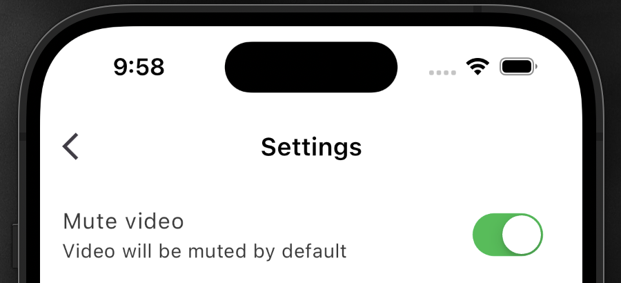

## MVVM (Model-View-ViewModel) 아키텍처

**MVVM: 사용자 인터페이스 중심의 애플리케이션 개발을 위한 소프트웨어 아키텍처 패턴**

1. **Model**: 애플리케이션의 데이터와 비즈니스 로직을 담당한다. 데이터베이스 접근, 네트워크 통신, 비즈니스 규칙 등을 포함한다.

2. **View**: 사용자에게 보여지는 UI 요소이다. 사용자의 입력을 받고, ViewModel을 통해 처리된 데이터를 표시한다.

3. **ViewModel**: View와 Model 사이의 연결 고리 역할을 수행한다. ViewModel은 Model로부터 데이터를 가져와서 View가 사용할 수 있는 형태로 변환하고, View의 사용자 입력에 따른 로직을 처리한다.

이 아키텍처는 UI와 비즈니스 로직의 엄격한 분리를 통해 코드의 재사용성, 테스트의 용이성, 유지보수의 효율성을 증진한다.


<br>

## Repository 아키텍처

**Repository 패턴은 데이터 소스와 애플리케이션 로직 사이의 추상화 계층을 제공하는 패턴**

1. **Repository**: 데이터 소스와의 상호작용을 캡슐화하고, 데이터 접근 로직을 중앙화한다. 데이터를 가져오고, 저장하며, 변환하는 역할을 수행한다.

2. **Data Source Abstraction**: 여러 데이터 소스(예: 로컬 데이터베이스, 웹 서비스)를 추상화한다. 이를 통해 애플리케이션 로직과 데이터 소스의 결합도를 낮추고, 유연성을 증가시킨다.

> Repository 패턴은 데이터 처리 로직의 일관성을 보장하고, 코드의 재사용성을 높이며, 애플리케이션의 테스트와 유지보수를 용이하게 한다. 데이터 캐싱, 동기화, 트랜잭션 관리와 같은 복잡한 데이터 관리 작업도 중앙에서 효율적으로 처리할 수 있다.


<br>

## 전체로직

### View:

- **사용자 인터페이스**: View는 사용자에게 보여지는 UI 부분이다. 사용자의 입력을 받고, ViewModel을 통해 제공된 데이터를 사용자에게 표시한다.

## ViewModel

1. **중개자 역할**:

    - 데이터 가공: ViewModel은 Model로부터 데이터를 가져와서 View에서 사용할 수 있도록 가공한다. 이 과정에는 데이터 형식의 변환, 필터링, 결합 등이 포함될 수 있다.

    - 데이터 흐름 관리: ViewModel은 데이터의 흐름을 관리하여, Model과 View 사이의 데이터 교환을 조정한다. 이를 통해 View는 비즈니스 로직으로부터 분리되며, 오직 UI 표현에 집중할 수 있습니다.

2. **데이터 바인딩과 상태 관리**:

    - 데이터 바인딩: ViewModel은 데이터 바인딩을 통해 View와 데이터 간의 동기화를 유지한다. 이는 View가 ViewModel의 상태 변화를 자동으로 감지하고 반응할 수 있게 해준다.

    - 상태 반영: 사용자 인터페이스의 상태 변경(예: 사용자 입력, 버튼 클릭, 화면 전환)이 ViewModel에 반영되며, 필요에 따라 Model을 업데이트할 수 있다.

    - 상태 변화 알림: ViewModel은 notifyListeners() 또는 유사한 메커니즘을 사용하여 View에 상태 변화를 알린다. 이는 View가 최신 데이터를 반영하여 사용자에게 표시할 수 있게 한다.

3. **사용자 인터페이스와 비즈니스 로직의 분리**:

    - ViewModel은 사용자 인터페이스(UI)의 로직을 처리하며, Model의 비즈니스 로직으로부터 UI 로직을 분리한다.


## Model


1. **비즈니스 로직**:

    - **정의 및 역할**: Model의 비즈니스 로직은 애플리케이션의 규칙과 절차를 구현한다. 이는 데이터를 처리하고, 애플리케이션의 핵심 기능을 수행하는 데 중요한 부분이다.

    - **유효성 검사**: 예를 들어, 사용자가 입력한 데이터가 특정 조건(형식, 범위, 무결성 등)을 만족하는지 확인한다.

    - **계산 및 변환**: 데이터에 대한 계산이나 변환을 수행한다. 예를 들어, 금융 애플리케이션에서 이자율 계산, 통계 애플리케이션에서 데이터 분석 등이 이에 해당한다.

    - **상태 관리**: Model은 애플리케이션의 현재 상태를 관리하며, 사용자의 로그인 상태, 구성 설정, 현재 진행 중인 작업의 상태 등을 유지한다.

2. **데이터 표현**:

    - **데이터 구조**: 객체, 클래스, 또는 데이터 스키마의 형태로 나타날 수 있습니다.

    - **데이터의 속성**: 사용자 프로필의 이름, 이메일, 프로필 사진 등의 속성을 가질 수 있다.

    - **데이터의 관계**: 복잡한 애플리케이션에서 Model은 데이터 간의 관계를 정의한다. 예를 들어, 게시글과 댓글, 사용자와 주문 등 데이터 간의 관계를 나타낸다.


## Repository

- **데이터 저장 및 검색**: Repository는 데이터 소스와의 상호작용을 관리한다. 이는 데이터를 저장하고 검색하는 작업을 포함하며, 데이터베이스 접근, API 호출, 로컬 파일 시스템 접근 등이 여기에 해당된다.

- **데이터 소스 추상화**: Repository는 데이터 소스의 세부 구현을 숨긴다. 이를 통해 애플리케이션의 나머지 부분은 데이터 소스의 구체적인 구현을 신경 쓰지 않고 데이터를 요청하거나 업데이트할 수 있다.

### "*코드의 유지보수성을 높이고, 각 부분의 독립적인 테스트와 개발을 가능하게 한다.*"

<br>


### main() 함수 설정


*`await`를 사용하기 위해 `WidgetsFlutterBinding.ensureInitialized()`로 Flutter의 엔진과 위젯 바인딩을 초기화한다. 


### *의존성 주입
>`final repository = PlaybackConfigRepository(preferences);`는 `SharedPreferences`의 인스턴스인 `preferences`를 `PlaybackConfigRepository`의 생성자에 주입하는 과정이다. 이로 인해 `PlaybackConfigRepository` 클래스 내부의 `_preferences` 필드는 이제 `SharedPreferences`의 인스턴스에 직접 연결되고, `PlaybackConfigRepository` 클래스는 `SharedPreferences` 인스턴스의 메서드를 호출하여, 애플리케이션의 설정 값을 저장하고 검색할 수 있다.

<br>
<br>

 
### `SharedPreferences.getInstance()`의 역할:

1. **싱글톤 인스턴스**: `getInstance()` 메서드는 `SharedPreferences` 클래스의 싱글톤 인스턴스를 반환한다. 싱글톤 인스턴스는 한 애플리케이션 내에서 단 하나만 존재하는 객체 인스턴스를 말하고, 싱글톤 디자인 패턴은 특정 클래스에 대해 전체 애플리케이션 실행 동안 단 한 번만 객체가 생성되고, 이 객체가 필요할 때마다 동일한 인스턴스가 재사용되도록 보장한다.

    >**싱글톤 인스턴스의 특징**

    - 유일성: 애플리케이션 내에서 그 클래스의 인스턴스가 오직 하나만 존재한다.

    - 전역 접근성: 싱글톤 인스턴스는 애플리케이션의 어느 곳에서든 접근할 수 있습니다. 이로 인해 전역 변수와 유사한 역할을 할 수 있다.

    - 지속성: 애플리케이션의 생명주기와 연결되어, 애플리케이션이 실행되는 동안 계속 존재한다.


2. **로컬 데이터 관리**: 반환된 `SharedPreferences` 인스턴스는 간단한 데이터를 로컬에 저장하고 불러오는 데 사용된다.

<br>

### SharedPreferences 데이터 저장 방식 부가 설명

- **데이터 저장**: SharedPreferences 인스턴스는 set 메서드를 제공하여 데이터를 저장한다. 예를 들어, setBool, setInt, setString 등의 메서드를 사용하여 각각 불리언, 정수, 문자열 등의 데이터를 저장할 수 있다. (_preferences.setBool('key', true)는 'key'라는 키에 대해 불리언 값을 true로 저장)

- **비동기 저장**: 저장 작업은 비동기적으로 수행된다. 이는 SharedPreferences가 내부적으로 I/O 작업을 수행하기 때문에, 메인 스레드를 차단하지 않고 백그라운드에서 데이터를 파일 시스템에 저장한다.


<br>


---
<br>

### SocialNetworkApp_Volume 초기화 문제

'SocicalNetwork' App 개발 중, 우측 이미지 Settings 화면에서 'Mute video' 토글 설정에 따라 왼쪽 화면 VideoPost에도 적용되어 아이콘이 이에따라 변하도록 구현했다. 설정값을 저장하기 위해 SharePreferences를 사용하였고, 'Hot reload', 또는 앱을 재시작해도 해당 값이 그대로 유지 될것 이라고 생각했다.




하지만 한가지 오류가 발생했다. 'Hot reload', 또는 앱을 재시작해도 해당 설정값은 유지되었고, VideoPost화면에서 아이콘 역시 이 설정값에 따라 의도한대로 변하였지만, VideoPost화면으로 이동하고 영상이 재생될 때, 'Mute video' 상태임에도 소리가 나오는 문제가 있었다.

로직에 문제가 있는 건 아닌지 ViewModel과 Model 및 Repository에 해당하는 파일을 재검토했고, 별다른 문제는 없는 듯 하였다.


### ViewModel


### Repository


그렇다면 왜 앱을 재시작 했을 경우에 문제가 생기는 것인가에 대해 생각해보았고, 우선 VideoPost화면의 초기화 단계에서 Volume값이 어떻게 설정되고 있는지 출력해 보았다.

Setting화면의 'Mute video'설정이 켜져있다면, 이 Volume은 원래 "0.0"으로 출력되어야 하나, 아래 이미지에서처럼 설정값에 관계없이 "1.0"으로 출력되고 있었다.


그렇다면 왜 ViewModel의 값이 전달되지 않는가에 대해 생각해보며 아래 코드를 확인해보았다.

```dart
context
        .read<PlaybackConfigViewModel>()
        .addListener(_onPlaybackConfigChanged);
```

문제는, `.addListener()`는 특정 상태의 변화가 생길 때, 이를 감지하고 콜백함수를 실행한다.
하지만, 앱을 실행하는 단계에서는 어떠한 변화도 발생기지 않기때문에 이 부분은 건너뛰게 되고, 따라서 ViewModel의 muted 값을 전달받지 못했던 것이었다.

따라서 아래의 코드를 통해 초기화를 해줌으로서 문제를 해결했다.

```dart
// ViewModel의 초기 상태를 반영
  final initialMuted = read<PlaybackConfigViewModel>().muted;
  if (initialMuted) {
    _videoPlayerController.setVolume(0);
  } else {
    _videoPlayerController.setVolume(1);
  }
```