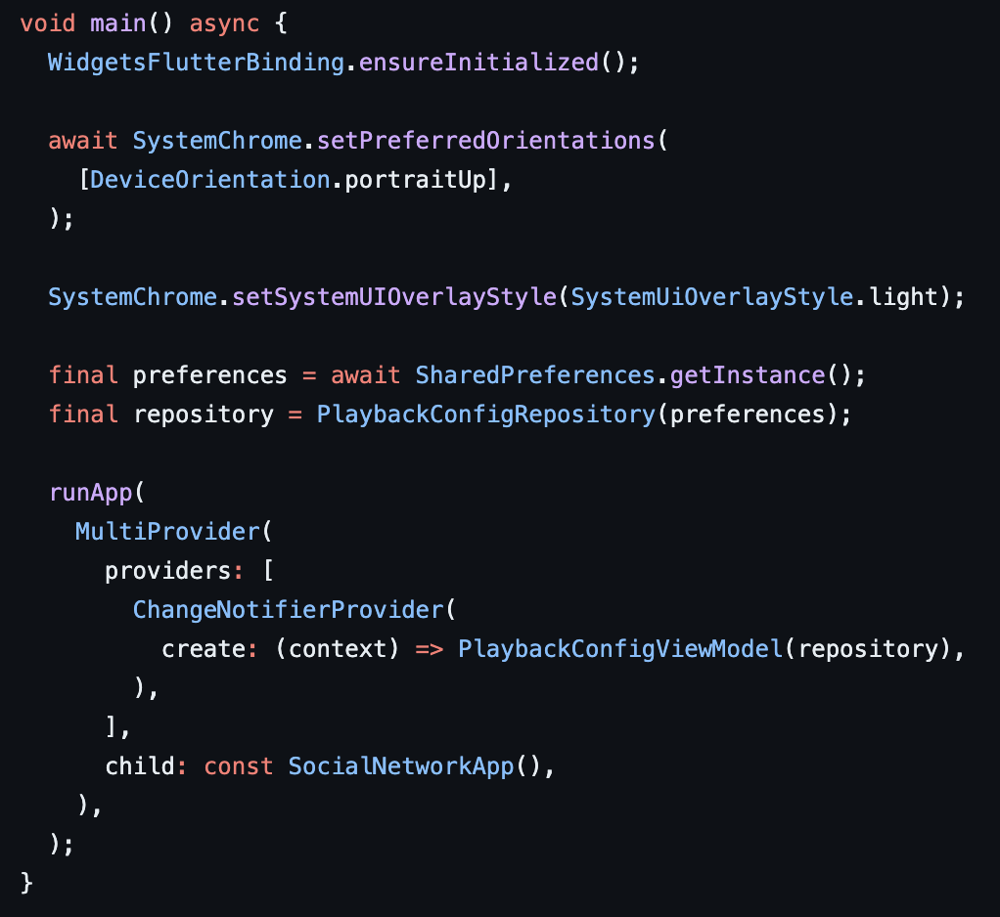
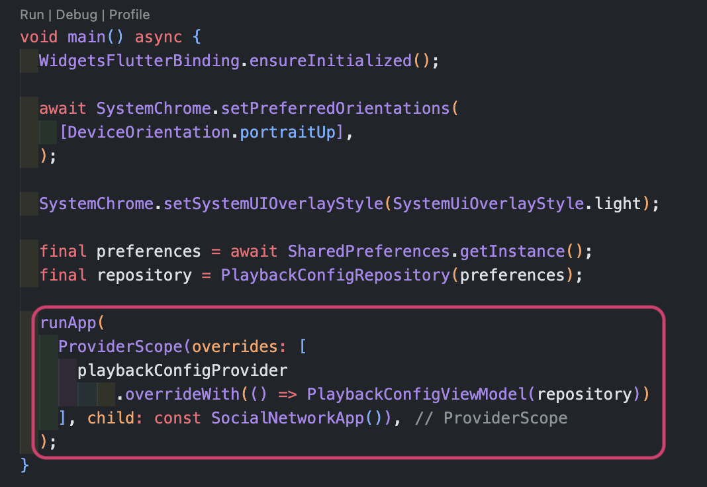
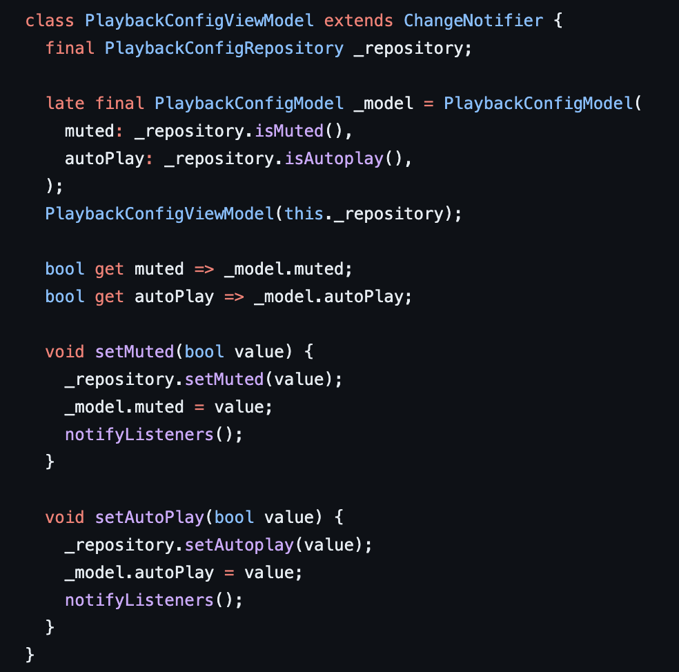
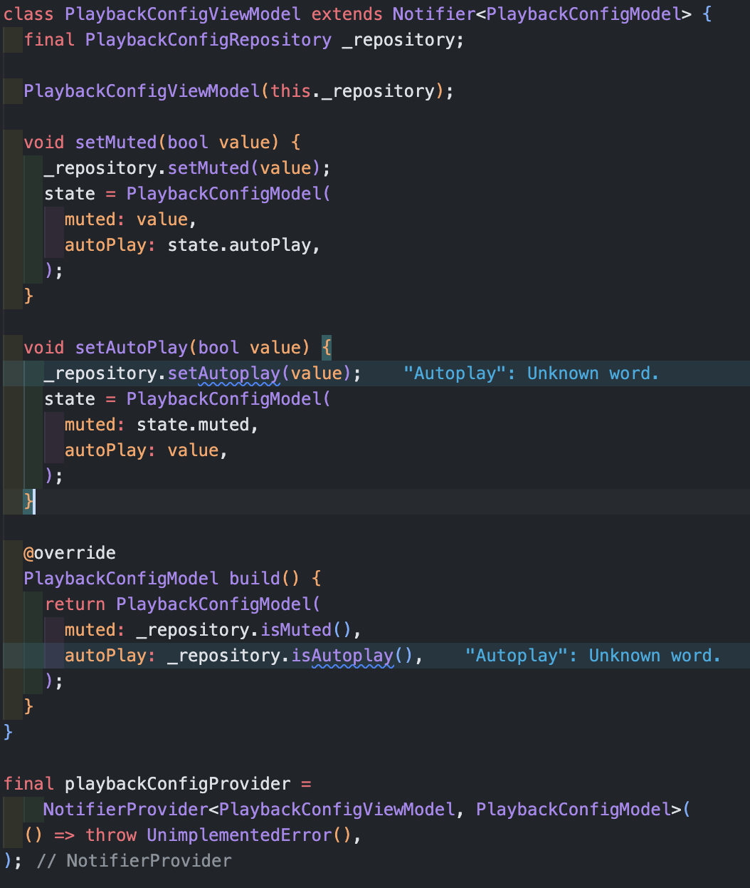
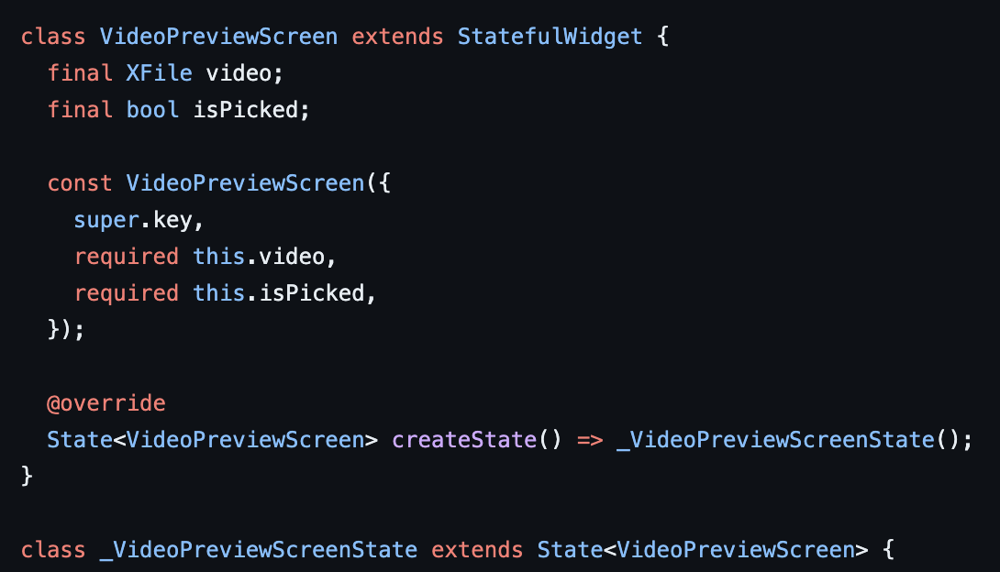
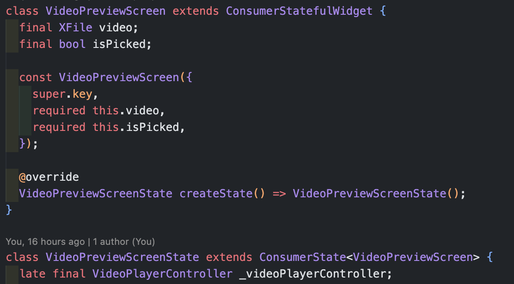

# Riverpod이란?

Riverpod는 Flutter에서 상태 관리를 혁신적으로 처리할 수 있는 라이브러리로, 기존의 Provider 패키지를 향상시킨 도구이다. Riverpod의 설계 목표는 개발자들이 보다 타입에서 안전하고, 유연하며, 테스트하기 쉬운 애플리케이션을 만들 수 있도록 한다.

### Riverpod의 핵심 기능:

1. **타입 안전성(Type Safety):**
   Riverpod은 각 Provider가 타입 매개변수를 가짐으로써, 컴파일 시점에 타입 체크를 강제하여 잘못된 타입의 객체가 제공되는 것을 방지하고, 코드의 안정성을 높인다.

2. **컨텍스트 독립성(Context Independence):**
   전통적인 Provider 패키지는 Flutter의 `BuildContext`에 의존했다. 하지만 Riverpod은 이러한 의존성을 제거하여 어느 범위에서든 동일한 방식으로 프로바이더를 사용할 수 있게 한다.

3. **테스트 및 오버라이드(Testability and Overridability):**
   `ProviderScope`을 통해 개발자는 테스트 중에 Provider를 쉽게 교체하거나 오버라이드할 수 있다. 이는 테스트 시나리오를 실제 앱의 복잡한 상태와 분리할 수 있게 해주어, 테스트의 질을 향상시킨다.

4. **다양한 Provider 타입(Variety of Provider Types):**
   Riverpod은 상태, Future, Stream 등 다양한 타입의 프로바이더를 제공한다. 이를 통해 개발자는 상황에 맞는 적절한 도구를 선택하여 상태 관리를 할 수 있다.

5. **글로벌 상태 관리(Global State Management):**
   Riverpod은 애플리케이션 전역의 상태를 손쉽게 관리할 수 있도록 글로벌 상태를 제공한다. 이는 단일 상태 트리를 통해 상태를 관리하고 앱의 모든 부분에서 동일한 상태에 접근할 수 있게 해준다.

### Riverpod 사용의 장점:

- **유연성(Flexibility):** Riverpod은 Provider의 개념을 확장하여 더 다양한 상태 관리 패턴을 지원한다. 예를 들어, `NotifierProvider`는 상태 변경 로직을 분리하고 보다 세밀한 상태 관리를 가능하게 한다.

- **코드의 명확성(Clearer Code):** Riverpod은 애플리케이션의 상태 관리 코드를 더 명확하고 선언적으로 만들어, 코드를 읽고 이해하기 쉽게 한다.

- **디버깅 용이성(Ease of Debugging):** Riverpod은 상태 변화를 추적하고 디버깅하는 데 필요한 도구를 제공한다.

- **컴파일 시 오류 체크(Compile-time Error Checking):** 잘못된 타입 사용이나 Provider 누락과 같은 오류를 컴파일 시점에 발견할 수 있다.

### 기본적인 예제와 시나리오:

다음은 간단한 문자열 값을 제공하는 `Provider`를 만들어, `Provider`가 앱 전체에서 접근 가능하며, UI 위젯에서 직접 사용될 수 있도록하는 예시코드이다.

```dart
final helloWorldProvider = Provider

((ref) => 'Hello World');

void main() {
  runApp(
    ProviderScope(
      child: MyApp(),
    ),
  );
}

class MyApp extends ConsumerWidget {
  @override
  Widget build(BuildContext context, WidgetRef ref) {
    // Provider에서 값을 읽기
    String value = ref.watch(helloWorldProvider);

    return MaterialApp(
      home: Scaffold(
        appBar: AppBar(title: Text(value)),
        body: Center(
          child: Text(value),
        ),
      ),
    );
  }
}
```

이 코드에서 `helloWorldProvider`는 앱에서 전역적으로 접근 가능한 상태를 제공하며, `ConsumerWidget`을 사용하여 이 상태를 UI에 바인딩한다. `ProviderScope`은 이러한 `Provider`를 앱의 모든 부분에서 사용할 수 있도록 해준다.

<br>
<br>


## 기존 코드 마이그레이션하기(Provider -> Riverpod)

기존 코드의 Provider 상태관리 로직을 Riverpod으로 마이그레이션을 하면서, 어떤 부분이 변경되고, 기능적으로 어떤 개선이 있는지 파악해보기 위해 코드를 하나하나 뜯어보았다.

### 기존의 Provider main()함수



먼저 기존 `main()`함수에서는 `MultiProvider`를 사용하여 여러 개의 Provider를 하나의 위젯 트리 아래에 배치할 수 있게 했다. 

- `ChangeNotifierProvider`는 `ChangeNotifier`를 상속받는 모델에 대한 인스턴스를 생성하고, 해당 모델의 변경을 리스닝하는 위젯들에게 알려주는 역할을 한다. 

- `create` 함수는 위젯 트리가 생성될 때 호출되며, 이를 통해 Provider가 관리하는 객체를 초기화하는 로직이며, `provider`는 `context`에 의존하여 위젯 트리에서 올바른 위치에서 Provider를 찾는다.


### Riverpod migration main()함수




- Riverpod을 적용한 `main()`함수에서 ProviderScope은 Riverpod의 모든 Provider들이 작동할 수 있는 범위(scope)를 정의한다. 

- `overrides` 속성은 특정 Provider에 대한 기본 동작을 오버라이드할 수 있도록 하는데, 이는 주로 테스팅이나 앱의 특정 부분에서 다른 동작을 원할 때 유용하다.

- Riverpod은 `context`에 의존하지 않으며, 따라서 `ProviderScope`은 어느 위치에서든지 위젯 트리에 배치할 수 있습니다. `ProviderScope` 아래에서는 모든 Provider에 대한 접근이 가능해지고, 위젯은 `Consumer`, `ConsumerWidget`, `useProvider` 등을 통해 Provider의 상태를 접근하고 구독할 수 있다.

<br>
<br>


### 기존 Provider playbackConfigViewModel




### Riverpod playbackConfigViewModel




### Riverpod 상태 관리 로직 설명

1. **ViewModel 클래스 정의:**
    - `PlaybackConfigViewModel` 클래스에서 기존의 `ChangeNotifier`이 `Notifier`로 변경되었고, 이 `Notifier`는 상태를 가지고 있고 이를 변경할 수 있는 메서드를 제공한다.

2. **상태 초기화:**
    - `PlaybackConfigViewModel`의 생성자에서 `_repository`를 인자로 받아 저장하고, 부모 클래스인 `Notifier`의 생성자를 호출하여 초기 상태를 설정한다. 기존의 PlaybackConfigModel를 이 단계에서 초기화 해주는 로직과 `getter`을 사용하여 값을 참조할 수 있도록 하는 로직이 여기선 불필요해졌다.

3. **상태 변경 메서드:**
    - `setMuted`와 `setAutoPlay` 메서드는 외부에서 호출될 수 있도록 공개(public) 메서드로 정의되었고, 각 메서드는 `_repository`를 통해 상태 변경을 지속적으로 저장한다.

    - 기존에 `notifyListeners`를 호출하여 상태를 관리했던 부분이, state 프로퍼티를 새 `PlaybackConfigModel` 인스턴스로 설정하여 상태를 업데이트하도록 변경되었다.

4. **상태 빌드 메서드:**
    - `build` 메서드는 `PlaybackConfigModel`을 반환한다. 이 메서드는 상태를 처음부터 재구성할 때 사용되며, `_repository`에서 현재의 `muted`과 `autoPlay` 값을 읽어서 새로운 `PlaybackConfigModel`을 생성한다.

5. **Provider 선언:**
    - `playbackConfigProvider`는 `NotifierProvider`를 통해 선언되었다. 이는 `PlaybackConfigViewModel` 타입의 객체를 생성하고 관리할 Provider이며, `NotifierProvider`는 상태를 리스닝하는 위젯들에게 상태 변경을 알릴 수 있습니다.

    - `NotifierProvider<PlaybackConfigViewModel, PlaybackConfigModel>`는 `PlaybackConfigViewModel`의 인스턴스를 생성하고 관리한다.

    - 여기서 `<PlaybackConfigViewModel, PlaybackConfigModel>`은 제네릭 타입 매개변수로, 첫 번째 매개변수는 Notifier의 타입을, 두 번째 매개변수는 Notifier이 관리할 상태의 타입을 나타낸다.

    ***UnimplementedError 예외 처리:**
    >- `NotifierProvider`의 생성 함수에서 `UnimplementedError`를 던짐으로써, 실제 Provider가 사용되기 전에는 오버라이드되어야 함을 나타낸다. 일반적으로 개발 초기 단계나 테스트 시에 임시로 사용되며, 실제 애플리케이션에서는 오버라이드하여 실제 `PlaybackConfigViewModel` 인스턴스를 제공해야 한다.

<br>
<br>

### Provider playbackConfigView



### Riverpod playbackConfigView




View에 해당하는 로직에서는 `StatelessWidget`은 `ConsumerWidget`, `StatefulWidget`은 `ConsumerStatefulWidget`으로 변경해주면 상태를 읽을 수 있다.

<br>

### ConsumerWidget?

`ConsumerWidget`은 `StatelessWidget`을 확장한 Riverpod의 위젯으로, 상태가 없는 위젯에서 Provider를 통해 제공된 데이터를 소비하고자 할 때 사용된다. `ConsumerWidget`은 `build` 메서드에 `WidgetRef` 파라미터를 추가하여, 이를 통해 Provider에서 상태를 읽을 수 있다. `ConsumerWidget`은 주로 UI가 Provider의 상태에 따라 변하지만, 내부적으로 상태를 관리할 필요가 없는 경우에 사용된다.

```dart
class MyConsumerWidget extends ConsumerWidget {
  @override
  Widget build(BuildContext context, WidgetRef ref) {
    final someValue = ref.watch(someProvider);
    // 위젯의 UI를 someValue를 사용하여 구성
  }
}
```

### ConsumerStatefulWidget?

`ConsumerStatefulWidget`은 `StatefulWidget`을 확장한 Riverpod의 위젯으로, 내부적으로 상태를 관리할 필요가 있는 복잡한 위젯에서 사용된다. 이 위젯을 사용하면, `ConsumerState`를 가지며, 이 상태 객체 내부에서 `ref.watch()`를 통해 프로바이더의 상태를 소비할 수 있다. `ConsumerStatefulWidget`은 위젯이 자체적인 상태를 가지고 있고, 동시에 외부 프로바이더의 상태에 의존하는 경우에 적합하다.

```dart
class MyConsumerStatefulWidget extends ConsumerStatefulWidget {
  @override
  _MyConsumerStatefulWidgetState createState() => _MyConsumerStatefulWidgetState();
}

class _MyConsumerStatefulWidgetState extends ConsumerState<MyConsumerStatefulWidget> {
  @override
  Widget build(BuildContext context) {
    final someValue = ref.watch(someProvider);
    // 위젯의 UI를 someValue와 내부 상태를 사용하여 구성
  }
}
```

`ConsumerStatefulWidget`은 `initState`, `dispose`, `didChangeDependencies`와 같은 생명주기 메서드를 제공하여, 위젯의 상태가 변화할 때 필요한 로직을 추가로 구현할 수 있게 해준다. 이는 애니메이션, 타이머, 서드파티 라이브러리의 콜백 등을 처리할 때 유용하다.


   <br>

### Provider와 Riverpod의 차이점:

- **Context 의존성**: Provider는 `context`를 사용해 현재 위젯 트리의 어느 위치에서든지 Provider를 찾을 수 있게 하는데 반면, Riverpod은 `context`에 의존하지 않고 독립적으로 Provider를 사용할 수 있게 한다.

- **테스트와 오버라이드**: Riverpod은 `overrides`를 통해 테스팅이나 특정 설정에 따른 오버라이드가 용이하다. Provider에서도 오버라이드는 가능하지만, Riverpod는 이를 더욱 명시적으로 지원한다.

- **타입 안전성**: Riverpod은 컴파일 타임에 Provider의 타입을 체크하기 때문에 타입 안전성이 더 높다.

- **글로벌 액세스**: Riverpod는 `ProviderScope`을 통해 앱의 어느 부분에서든지 동일한 인스턴스에 접근할 수 있는 글로벌 액세스를 제공한다.


>Riverpod를 사용하여 결합도가 감소한다는 것은, 애플리케이션의 다양한 부분이 서로 너무 밀접하게 연결되어 있지 않고, 독립적으로 동작할 수 있음을 의미한다. 결합도가 낮으면 각 부분(모듈, 함수, 클래스 등)을 독립적으로 변경하거나 재사용할 수 있게 되어, 유지보수와 확장성이 향상된다.

### Riverpod를 사용한 결합도 감소 예시:

**전통적인 Provider 사용 예:**

```dart
class MyWidget extends StatelessWidget {
  @override
  Widget build(BuildContext context) {
    final myModel = Provider.of<MyModel>(context); // context에 의존
    return Text(myModel.someValue);
  }
}
```

위 예시에서 `MyWidget`은 `BuildContext`를 통해 상태를 찾는다. 이는 `MyWidget`이 특정 `BuildContext`에 종속되어 있음을 의미하며, 이를 변경하거나 재사용할 때 제약이 따른다.

**Riverpod 사용 예:**

```dart
final myModelProvider = Provider((ref) => MyModel());

class MyWidget extends ConsumerWidget {
  @override
  Widget build(BuildContext context, WidgetRef ref) {
    final myModel = ref.watch(myModelProvider); // context에 의존하지 않음
    return Text(myModel.someValue);
  }
}
```

위 예시에서 `MyWidget`은 `BuildContext`에 의존하지 않고 `WidgetRef`를 통해 상태를 찾는다. 이는 `MyWidget`을 다양한 위치에서 재사용할 수 있게 하며, 테스트나 다른 설정에서 `myModelProvider`를 오버라이드하기 쉽다.


*"Riverpod의 이러한 설계는 애플리케이션의 유연성을 대폭 향상시키며, 더 나은 아키텍처 설계를 가능하게 한다."*