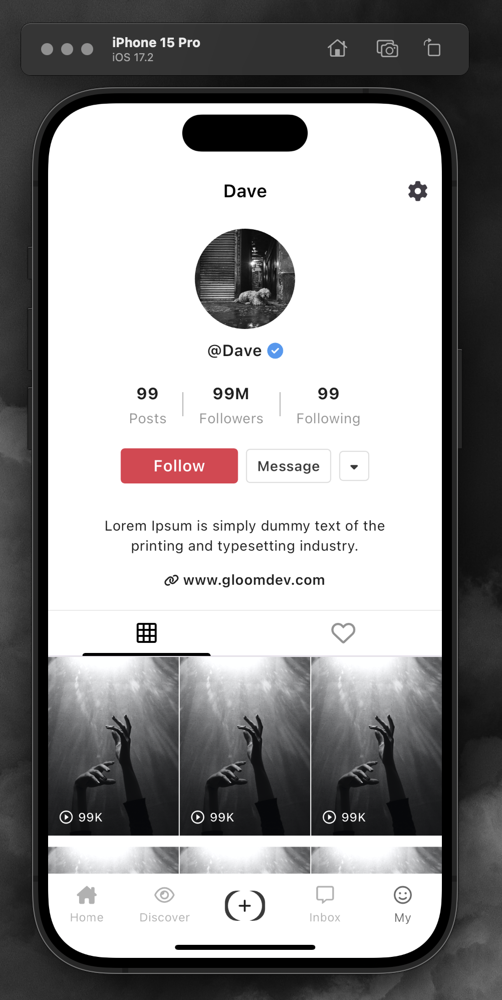
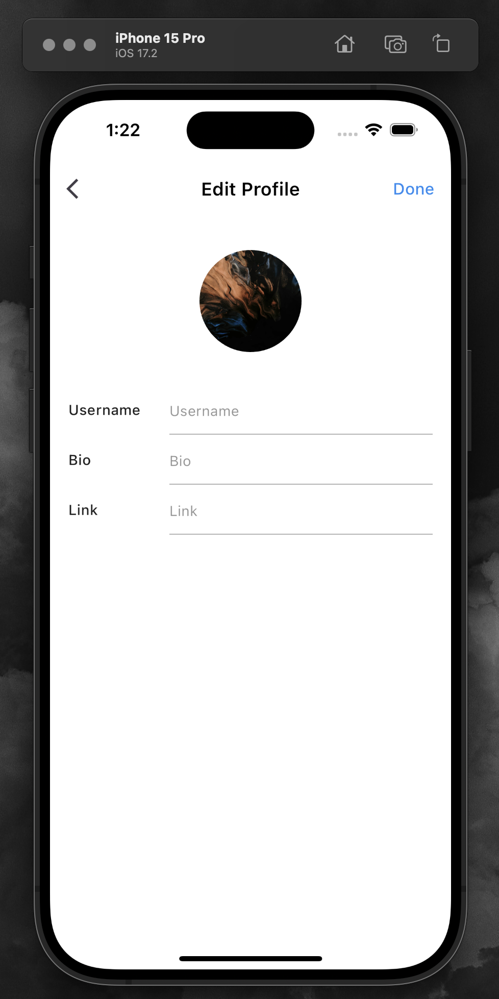
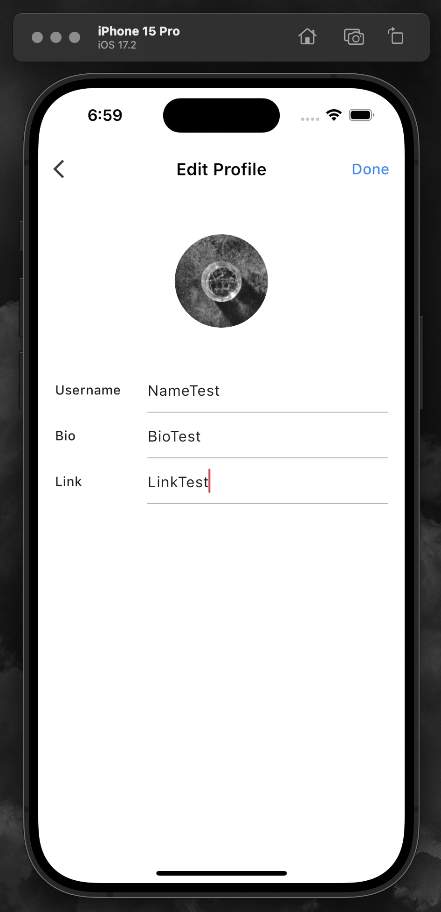
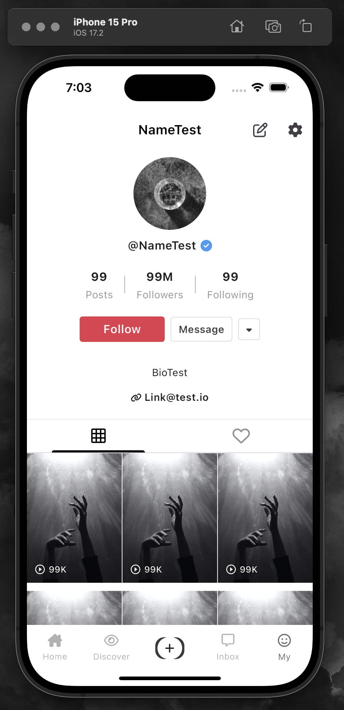
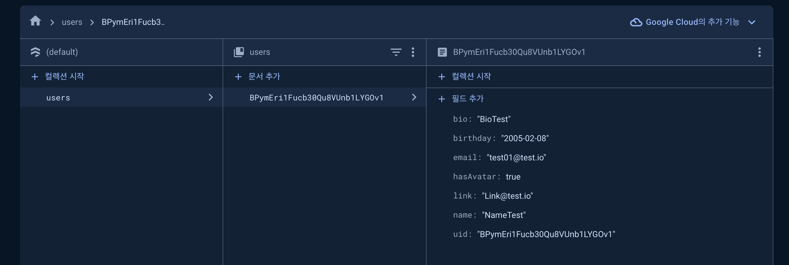

*"기존의 유저 프로필 화면에서 프로필 수정 기능을 riverpod을 사용하여 수정된 데이터를 Firebase 데이터베이스에 반영하고, 업데이트하여 상태관리를 보다 효율적으로 개선하고자하였다."*




*"우선, 이 프로젝에선 MVVM architecture 패턴을 따르고, 다음과 같이 'View'에 해당하는 UI를 구성해보았다."*



*"기존 데이터 구조에서 email, uid, bithday와 같은 정보들은 회원가입 절차에서 제공받기 때문에, `copywith`메서드를 정의함으로써, 기존 데이터의 불변성은 유지하면서 원하는 필드의 값을 업데이트 할 수 있도록 해야했다."*

### User Profile Model - `copyWith`메소드 정의
```dart
UserProfileModel copyWith({
    String? uid,
    String? email,
    String? name,
    String? bio,
    String? link,
    String? birthday,
    bool? hasAvatar,
  }) {
    return UserProfileModel(
      uid: uid ?? this.uid,
      email: email ?? this.email,
      name: name ?? this.name,
      bio: bio ?? this.bio,
      link: link ?? this.link,
      birthday: birthday ?? this.birthday,
      hasAvatar: hasAvatar ?? this.hasAvatar,
    );
  }
```

*"유저가 textfield에 입력하는 텍스트 데이터가 Done을 눌렀을 때 UI에 적용되도록 로직을 계획했고, User관련 비즈니스 로직을 처리하는 ViewModel에 다음과 같이 메소드를 작성함과 동시에 해당 데이터의 상태를 관리하기 위한 `StateProvider`를 정의하였다."*

### UsersViewModel - 일부 필드 값 업데이트
```dart
class UsersViewModel extends AsyncNotifier<UserProfileModel> {
  late final UserRepository _userRepository;
  late final AuthenticationRepository _authenticationRepository;

  @override
  FutureOr<UserProfileModel> build() async {
    _userRepository = ref.read(userRepo);
    _authenticationRepository = ref.read(authRepo);

    if (_authenticationRepository.isLoggedIn) {
      final profile = await _userRepository
          .findProfile(_authenticationRepository.user!.uid);
      if (profile != null) {
        return UserProfileModel.fromJson(profile);
      }
    }

    return UserProfileModel.empty();
  }

  Future<void> createProfile(UserCredential credential) async {
    final signUpInfo = ref.read(signUpForm.notifier).state;

    final username = signUpInfo["username"] ?? "Anonymous"; 
    final birthday =
        signUpInfo["birthday"] ?? ""; 
    if (credential.user == null) {
      throw Exception("Account creation failed. Please try again.");
    }
    final bio = "";
    final link = "";
    state = const AsyncValue.loading();
    final profile = UserProfileModel(
      hasAvatar: false,
      bio: bio,
      link: link,
      email: credential.user!.email ?? "Anonymous@user.com",
      uid: credential.user!.uid,
      name: username,
      birthday: birthday,
    );

    await _userRepository.createProfile(profile);
    state = AsyncValue.data(profile);
  }


    // 일부 필드 값 변경을 위한 메소드 작성
    Future<void> onAvatarUpload() async {
    if (state.value == null) return;
    state = AsyncValue.data(state.value!.copyWith(hasAvatar: true));
    await _userRepository.updateUser(state.value!.uid, {"hasAvatar": true});
  }

  Future<void> onUsernameUpdate(String username) async {
    if (state.value == null) return;
    state = AsyncValue.data(state.value!.copyWith(name: username));
    await _userRepository.updateUser(state.value!.uid, {"name": username});
  }

  Future<void> onBioUpdate(String bio) async {
    if (state.value == null) return;
    state = AsyncValue.data(state.value!.copyWith(bio: bio));
    await _userRepository.updateUser(state.value!.uid, {"bio": bio});
  }

  Future<void> onLinkUpdate(String link) async {
    if (state.value == null) return;
    state = AsyncValue.data(state.value!.copyWith(link: link));
    await _userRepository.updateUser(state.value!.uid, {"link": link});
  }


final usersProvider = AsyncNotifierProvider<UsersViewModel, UserProfileModel>(
    () => UsersViewModel());
}

// 데이터 상태 관리를 위한 String 타입의 StateProvider 선언
final usernameProvider = StateProvider<String>((ref) => '');
final bioProvider = StateProvider<String>((ref) => '');
final linkProvider = StateProvider<String>((ref) => '');

```
*"위처럼 각 필드에 해당하는 StateProvider를 정의함으로써, View에서 유저가 textfield에 입력한 값을 앱 전체에 적용할 수 있게되고, 수정이 완료된 상태는 다음과 같고,"*




### *"Firebase 데이터 베이스에도 잘 적용된 것을 볼 수 있다."*

