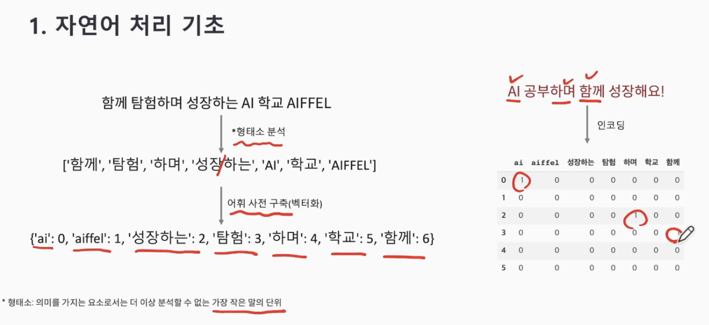
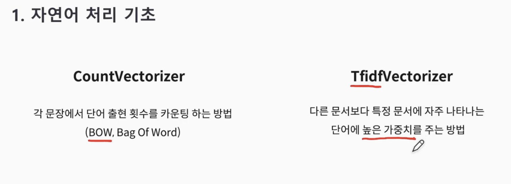

> ## 자연어 처리?
> 자연어 처리(Natural Language Processing, NLP)는 인간의 언어를 컴퓨터가 이해하고 처리할 수 있도록 하는 인공지능의 한 분야.
> 자연어는 사람들이 일상적으로 사용하는 언어를 의미하며, 자연어 처리는 이러한 자연어를 이해하고 분석하는 작업을 포함

### "머신러닝에 텍스트를 넣기 위해서는 숫자로 반드시 변경!" (형태소분석)

#### 쪼갠 형태소를 가지고 벡터화 -> 어휘사전 구축 -> 새로운 text 인코딩

> ## 벡터화? 인코딩?
> 인코딩은 데이터를 다른 형태로 변환하는 과정을 일반적으로 의미하며, 텍스트 데이터의 벡터화는 텍스트를 수치 형태로 변환하는 특정한 종류의 인코딩 작업을 의미
> 벡터화는 텍스트 데이터의 특징을 수치 형태로 표현하여 기계 학습 모델에 입력할 수 있는 형태로 만드는 것을 목적으로 함

## 텍스트 데이터를 벡터로 변환하는 데 사용되는 피쳐 추출 방법
### CountVectorizer에서 보완된 방법: TfidfVectorizer

### TF-IDF

> TF-IDF(Term Frequency-Inverse Document Frequency)는 정보 검색 및 텍스트 마이닝 분야에서 널리 사용되는 가중치 계산 방법, 이 방법은 특정 문서 내에서 특정 용어의 중요성을 측정하는 데 사용됨

> TF(Term Frequency)는 특정 문서 내에서 용어가 나타나는 빈도를 측정. 즉, 문서에서 용어가 얼마나 자주 나타나는지를 나타냄
> 보통은 문서 내에서 용어의 출현 횟수를 용어의 총 등장 횟수로 나눠 정규화

> IDF(Inverse Document Frequency)는 특정 용어의 정보를 문서 집합 전체에서 얼마나 중요한지를 측정. IDF는 로그 역빈도를 사용하여 계산되며,
> 문서 집합 전체에서 특정 용어가 나타나는 문서의 수의 역수를 의미.  즉, **특정 용어가 전체 문서 집합에서 많이 나타날수록 IDF 값은 낮아짐.**

### CountVectorizer과TfidfVectorizer의 차이

- **CountVectorizer**: 단어의 빈도수를 카운트해서 텍스트를 벡터화하고, 단어 순서나 문맥을 고려하지 않습니다. 단어의 등장 횟수를 직접 카운트하여 벡터를 생성합니다.

- **TfidfVectorizer**: 단어의 빈도수뿐만 아니라 단어의 전체 문서 집합에서의 중요성을 고려하여 텍스트를 벡터화합니다. TF-IDF 점수는 단어의 등장 빈도에 IDF 점수를 곱하여 계산됩니다. 이를 통해 특정 단어가 특정 문서 에서 자주 나타나지만, 전체 문서에서는 그렇지 않은 경우를 높은 점수로 부여합니다.

### CountVectorizer 장단점

**장점**:
1. 간단하고 직관적인 사용법
2. 자연어 처리에 적합한 전통적인 방법
3. 단어 빈도 정보 포함

**단점**:
1. 단어 순서 정보 손실
2. 불필요한 특징의 필요성
3. 높은 차원성

### TfidfVectorizer 장단점

**장점**:
1. 단어의 상대적 중요성 반영
2. 불용어 처리 자동화
3. 다양한 매개변수 조정 가능

**단점**:
1. 모델의 길이에 영향 받음
2. 단어 순서 정보 손실
3. 차원성 문제
