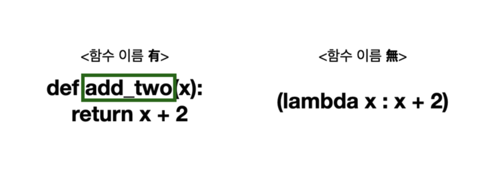
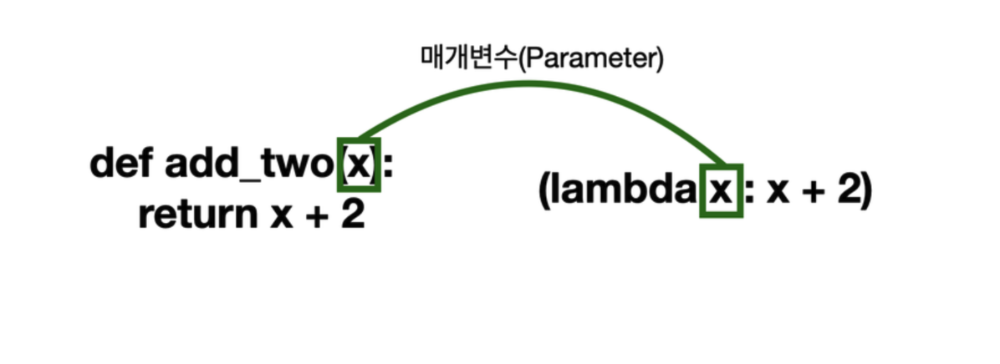
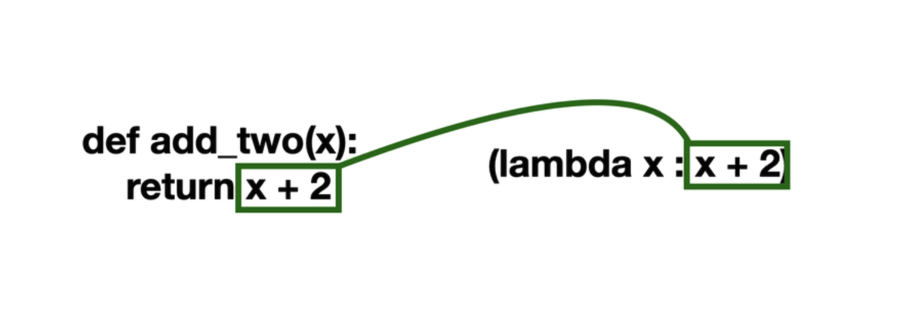

> ## 람다 표현식이란?
>  람다를 포함한 식을 람다 표현식(Lambda Expression) 이라고 부르고, 람다 표현식으로 쓴 함수는 람다 함수(또는 익명 함수)라고 한다
>  람다 함수는 간단하고, 코드를 조금 더 효율적으로 작성할 수 있다

````python
(lambda 매개변수 : 리턴값)(인수)
````








- 람다 함수는 익명의 함수를 만들기 때문에, 함수를 생성한 이후에 다시 이 함수를 호출하려면 람다 표현식을 변수에 할당해주어야 한다.
- 변수에 람다 표현식을 할당하려면 괄호는 생략
- 람다 표현식 안에서는 새 변수를 만들 수 없음(새로운 변수가 필요한 코드일 경우에는 일반 함수를 작성)
- 바깥 변수를 참조하는 것은 가능

### 람다 표현식을 인수로 사용하는 함수 3가지

- ### map()
  ````
  map(적용시킬 함수, 적용할 값들)

  # 표현 방식
  map(함수, 리스트 or 튜플)
  ````
- ### filter()

  ```python
  # list(filter() + 람다 함수)
  list(filter(lambda x : x % 2 == 1, two)) # 출력값: [1, 3, 5, 7, 9]

  # 파이썬은 조건이 없으면 True일 때만 통과
  list(filter(lambda x : x % 2, two))   # 출력값: [1, 3, 5, 7, 9]
                                      # 파이썬은 다른 조건이 없으면 참일 때만 통과시키기 때문에 비교 연산자 ==가 없어도 출력
  ```
    - 리스트에 들어있는 원소들을 함수에 적용시켜서 결과가 참인 값들로 구성된 새로운 리스트를 만들어준다.
    - filter()를 사용하면 리스트에서 원하는 값들만 남길 수 있다.
  
- ### reduce()
  결과를 누적해서 반환하는 함수
  ```python
  reduce(함수, 이터러블 객체) # 파이썬3부턴 내장함수가 아님(from functools import reduce 로 실행가능)
  ```
  > [참고] functools 모듈
  > functools 모듈은 고차원 함수(high-order-function)를 위해 만들어진 것으로, 다른 함수에 작용하거나 다른 함수를 반환하는 함수입니다.
  > [파이썬 공식 문서](https://docs.python.org/ko/3/library/functools.html)

## 일급 객체

> 객체란?
> 객체(Object)는 속성(값or변수)과 행동(함수)을 가지고 있는 대상

> 객체 지향 프로그래밍은 무엇일까요?
> 프로그램을 구성하는 요소들을 객체로 표현하고, 객체간에 상호작용하도록 하는 프로그래밍 기법

## 일급 객체란?

> 일급 객체(first-class object)란 파이썬과 같은 객체 지향 프로그래밍에서 사용되는 개념 중 하나로, 다른 객체들에 일반적으로 적용할 수 있는 연산을 모두 지원하는 객체입니다. 여기서 연산이란 연산자로 수행할 수 있는 연산뿐만 아니라 인자로 넘기기, 비교하기, 수정하기, 변수에 대입하기 등을 의미합니다. 
> 1. 변수에 할당하거나 데이터 구조(자료구조) 안에 그 객체를 담을 수 있다.
> 2. 매개변수로 전달할 수 있다.
> 3. 리턴값으로 사용될 수 있다.
